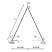

# Static Von Mises Truss example
---

In this tutorial, the Static Von Mises Truss example and its resolutions using ONSAS are described. The aim of this example is to validate the Newton-Raphson and the Arc-Length methods implementation by comparing the results provided by ONSAS with the analytical solution.
 
The structural model is formed by two truss elements as it is shown in the figure, with the node $2$ submitted to a nodal load $P$ and restrained to movement in the $x-z$ plane and nodes $1$ and $3$ fixed.



The Octave script is avaiable at: [RUTA]()
 
Before defining the structs, the workspace is cleaned, the ONSAS directory is added to the path and scalar auxiliar parameters are defined.
```
close all, clear all ;
addpath( [ pwd '/../../src'] ); 
E = 210e9 ;  A = 2.5e-3 ; ang1 = 65 ; L = 2 ; nu = 0 ;
auxx = cos( ang1*pi/180 ) * L ;  auxz = sin( ang1*pi/180 ) * L ;
```

## MEBI parameters
------------------

The modelling of the structure begins with the definition of the Material-Element-BoundaryConditions-InitialConditions (MEBI) parameters.

### materials
 Since both bars are formed by the same material all the fields of the `materials` struct will have only one entry. contains only one vector. The constitutive behavior is the SaintVenantKirchhoff:
```
materials.hyperElasModel  = { 'SVK'} ;
```
 and the parameters of this model are the Lamé parameters
```
lambda = E*nu/((1+nu)*(1-2*nu)) ; mu = E / (2*(1+nu));
materials.hyperElasParams = { [ lambda  mu  ] } ;
```

## elements

Two different types of elements are considered, node and truss. The nodes will be assigned in the first entry (index $1$) and the truss at the index $2$. The elemType field is then:
```
elements.elemType = { 'node','truss' } ;
```
 for the geometries, the node has not geometry to assign (empty array), and the truss elements will be set as a square-cross section, then the elemTypeGeometry field is:
```
elements.elemTypeGeometry = { [], [2 sqrt(A) sqrt(A) ] };
elements.elemTypeParams = { [], 1 };
```

## boundaryConds

 The elements are submitted to two different BC settings. The nodes $1$ and $3$ are fixed without applied loads (first BC), and node $2$ has a constraint in displacement and an applied load (second BC).

```
boundaryConds.loadCoordSys = { []        ; 'global'   } ;
boundaryConds.loadTimeFact = { []        ; @(t) 1.5e8*t     } ;
boundaryConds.loadBaseVals = { []        ; [ 0 0 0 0 -1 0 ] } ;
boundaryConds.impoDispDofs = { [ 1 3 5 ] ; 3          } ;
boundaryConds.impoDispVals = { [ 0 0 0 ] ; 0          } ;
```

## initial Conditions
 homogeneous initial conditions are considered, then an empty struct is set:
```
initialConds                = struct() ;
```

## mesh parameters
The coordinates of the nodes of the mesh are given by the matrix:
```
mesh.nodesCoords = [      0  0     0  ; ...
                       auxx  0  auxz  ; ...
                     2*auxx  0     0  ] ;
```
The connectivity is introduced using the _conecCell_. Each entry of the cell contains a vector with the four indexes of the MEBI parameters, followed by the indexes of the nodes of the element (node connectivity). For didactical purposes each element entry is commented. First the cell is initialized:
```
mesh.conecCell = { } ;
```
 then the first two nodes are defined, both with material zero (since nodes dont have material), the first element type (the first entry of the cells of the _elements_ struct), and the first entry of the cells of the boundary conditions struct. No non-homogeneous initial condition is considered (then zero is used) and finally the node is included.
```
mesh.conecCell{ 1, 1 } = [ 0 1 1 0  1   ] ; 
mesh.conecCell{ 2, 1 } = [ 0 1 1 0  3   ] ; 
```
 the following case only differs in the boundary condition
```
mesh.conecCell{ 3, 1 } = [ 0 1 2 0  2   ] ; 
```
 the truss elements are formed by the first material, the second type of element, and no boundary condition is applied.
```
mesh.conecCell{ 4, 1 } = [ 1 2 0 0  1 2 ] ;
mesh.conecCell{ 5, 1 } = [ 1 2 0 0  2 3 ] ; 
```

## analysisSettings
```
analysisSettings.methodName    = 'newtonRaphson' ;
analysisSettings.deltaT        = 0.1 ;
analysisSettings.finalTime     =   1 ;
analysisSettings.stopTolDeltau =   1e-6 ;
analysisSettings.stopTolForces =   1e-6 ;
analysisSettings.stopTolIts    =   10 ;
analysisSettings.finalTime     =   1 ;
```

## otherParams
```
otherParams.problemName = 'staticVonMisesTruss_NR';
otherParams.plotParamsVector = [3];
otherParams.controlDofs = [2 5 ];
```

## ONSAS execution

```
[matUs, loadFactorsMat] = ONSAS( materials, elements, boundaryConds, initialConds, mesh, analysisSettings, otherParams ) ;
```

```

analyticFunc    = @(w) 2 * E * A * sin(ang1 * pi / 180 )^2 * w / L ;

numDisp =  -matUs(11,:) ;

figure
plot( numDisp , loadFactorsMat(:,2) ,'b' )
hold on, grid on
plot( numDisp , analyticFunc( numDisp),'r' )

l0           = sqrt(auxx^2 + auxz^2) ;
analyticFunc = @(w) -2 * E*A* ( (  (auxz+(-w)).^2 + auxx^2 - l0^2 ) ./ (l0 * ( l0 + sqrt((auxz+(-w)).^2 + auxx^2) )) ) ...
            .* (auxz+(-w)) ./ ( sqrt((auxz+(-w)).^2 + auxx^2) )  ; 
hold on, grid on
plot( numDisp , analyticFunc( numDisp), 'g' )


% ===============================================
% methods comparison
% ====================================
% second case: newton raphson analysis
% ===============================================
% third case: NRarc-length analysis with dxf mesh
% ----------------------------------------------------------------------
% --- plots --
%l0           = sqrt(auxx^2 + auxz^2) ;
% analyticFunc = @(w) -2 * E*A* ( (  (auxz+(-w)).^2 + auxx^2 - l0^2 ) ./ (l0 * ( l0 + sqrt((auxz+(-w)).^2 + auxx^2) )) ) ...
% .* (auxz+(-w)) ./ ( sqrt((auxz+(-w)).^2 + auxx^2) )  ; 
%
%% analytical solution using engineering strain
% analyticFunc = @(w)  -2 * E*A* ( (  (auxz+(-w)).^2 + auxx^2 - l0^2 ) ./ (l0 * ( l0 + sqrt((auxz+(-w)).^2 + auxx^2) )) ) ...
 %~ .* (auxz+(-w)) ./ ( sqrt((auxz+(-w)).^2 + auxx^2) )  ; 
%
%~ lw = 2.0 ; ms = 11 ; plotfontsize = 22 ;
%~ figure
%~ plot( controlDispsNRAL, analyticNRAL ,'b-x' , 'linewidth', lw,'markersize',ms )
%~ hold on, grid on
%~ plot( controlDispsNRAL, loadFactorsNRAL,'r-s' , 'linewidth', lw,'markersize',ms )
%~ plot( controlDispsNR, loadFactorsNR,'k-o' , 'linewidth', lw,'markersize',ms )
%~ labx = xlabel('Displacement');   laby = ylabel('$\lambda$') ;
%~ legend('analytic','NRAL-DXF','NR','location','North')
%~ set(gca, 'linewidth', 1.2, 'fontsize', plotfontsize )
%~ set(labx, 'FontSize', plotfontsize); set(laby, 'FontSize', plotfontsize) ;


  %~ [verifBoolean, numericalVals, analyticVals] = analyticSolVerif ...
    %~ ( analytSol, analyticFunc, loadFactors, controlDisps, timesVec, ...
    %~ analyticCheckTolerance, analyticSolFlag, problemName, printFlag, outputDir, plotParamsVector );


