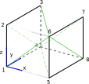

# Uniaxial Extension Solid

In this tutorial an elastic solid submitted to uniaxial loading is considered.
The geometry is given by $L_x$, $L_y$ and $L_z$, and a tension $p$ is applied on
the face at $x=L_x$, see the diagram below.

We begin by defining the structural properties of the mesh.

The material properties of the model are defined by the MELCS parameters. In this case a SVK material is considered.

``\\def\\svgwidth{40mm}\\input{solidCube.pdf_tex}``

This model can be solved analytically and the result shows a good match between
the analytic result and the numerical solution obtained with ONSAS.
